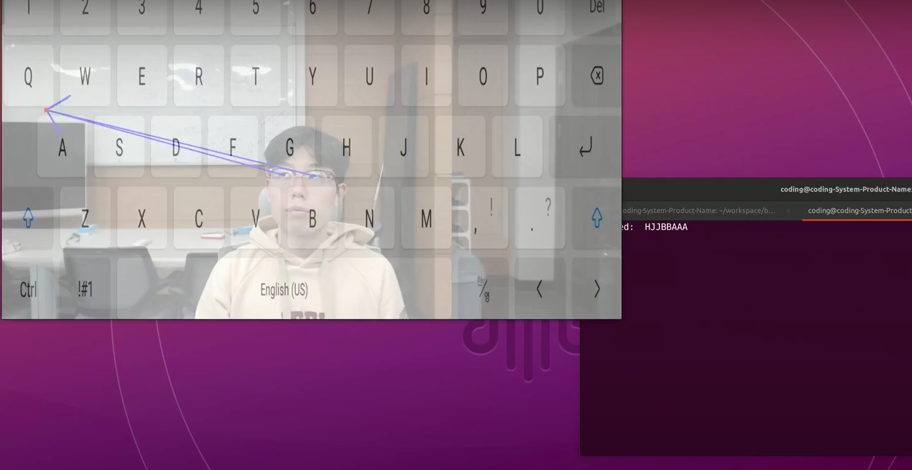

# Eyeboard: Type with your eyes!


"Eyeboard" is a demo project designed to capture the movement of the eyes' gaze angle and enable keyboard input. This project assists individuals with limited mobility in their body to input keyboard commands through the movement of their eyes. 


**If you gaze at a single character on the keyboard for about 1 second, the corresponding character will be input.**


You can see a brief demo video on [this link](https://drive.google.com/file/d/1yKe6qFne-0HeNzOe9iZPC_g-FutmzfFH/view).


※ Prerequisites: I will assume that you have appropriately installed OpenVINO and open_model_zoo. You will need a webcam that supports a resolution of 1280 * 720.

```
git clone https://github.com/hanjae98/eyeboard.git
```

```
cd eyeboard
```

```
cp -r ./gaze-estimation-demo <OPEN_MODEL_ZOO_DIR>/demos/
```

```
cd <OPEN_MODEL_ZOO_DIR>/demos
```

```
./build_demos.sh
```

```
cd <COMPILED_DIR>/ # For me, /home/name/omz_demos_build/intel64/Release/
```

```cp -r <EYEBOARD_DIR>/needs/* .```

check your cameras on system via [camera_command]
Open the run.sh file using your preferred text editor.
```
[sudo ./gaze_estimation_demo -d CPU -i <YOUR_CAM_ID> ...] 
``` 

Find your camera ID and make the necessary modifications to the part corresponding to your camera ID. You can use ```v4l-utils``` command to find available webcams. 

```
sudo apt-get install v4l-utils
```
```
v4l2-ctl --list-devices
```


Remember to ensure that your camera supports a resolution of 1280*720.

All done. just enter ``./run.sh ``.


